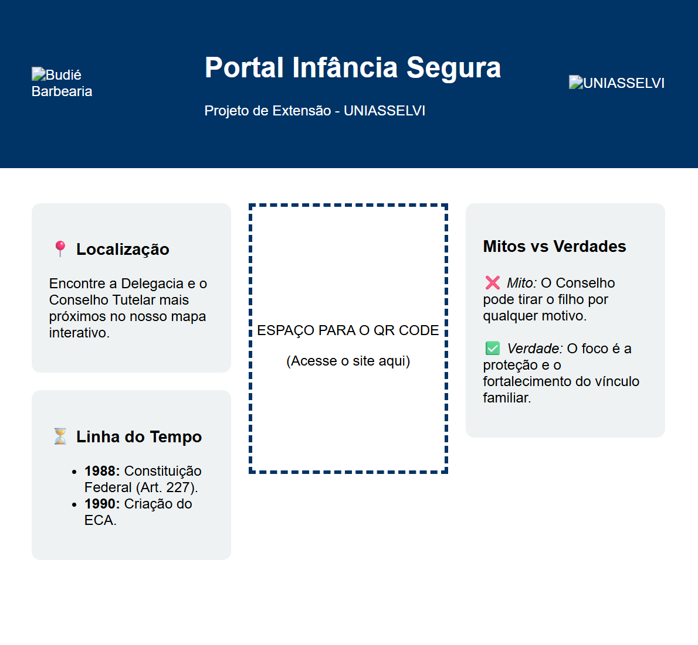
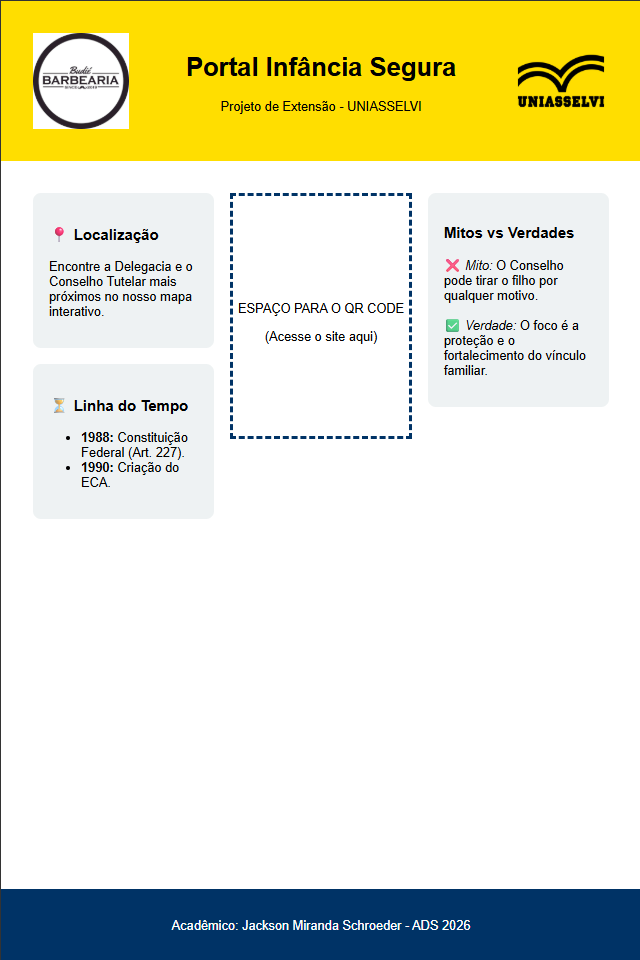
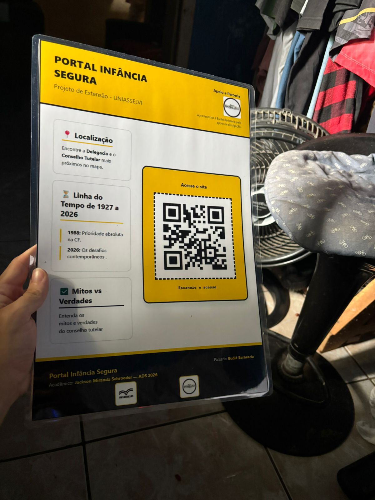

Processo de criação do Banner, mostrar o passo a passo já que fiz tudo de uma vez só,
eu acabei salvando o projeto em "fotos" para mostrar para amigos enquanto trabalhava nele 
para receber feedback e sugestões, inclusive, agradecimento especial ao Angelo @pregonocaixão (insta)
por ter formatado a imagem para o qrcode ficar certo na impressão.

